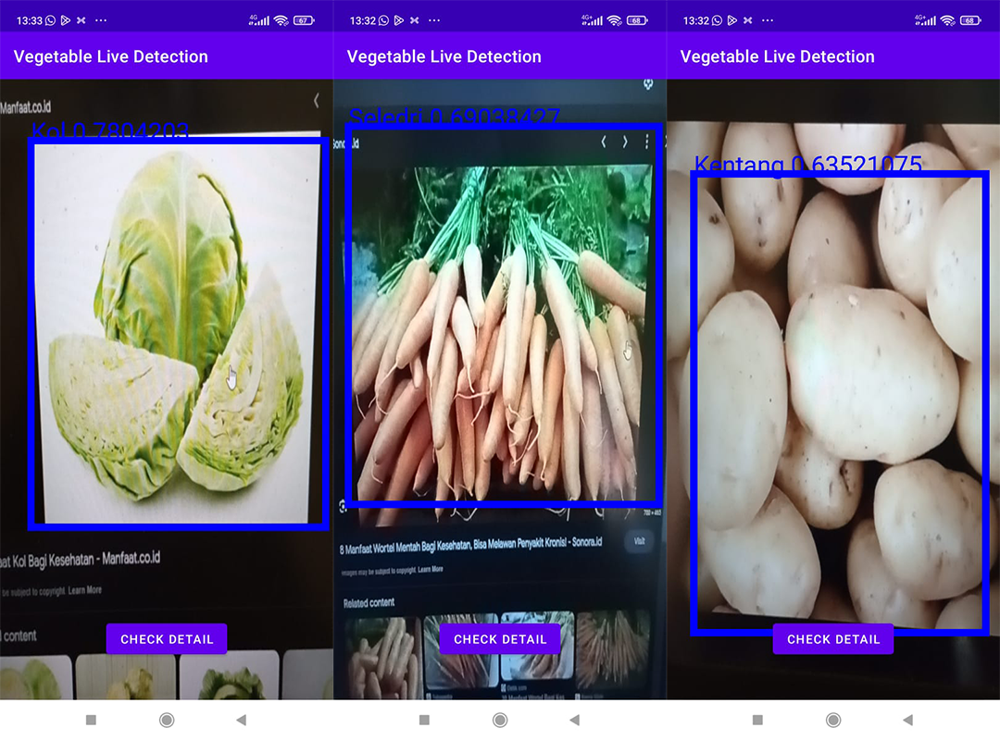

# Vegetable Live Detection

## Deskripsi
Repositori ini berisi kode untuk menguji model machine learning pada aplikasi Android yang bertujuan untuk mendeteksi jenis sayuran secara real-time. Aplikasi ini menggunakan teknologi Computer Vision untuk memproses gambar dari kamera ponsel dan mengenali jenis sayuran yang sedang ditampilkan.

## Fitur Utama
- Deteksi real-time: Aplikasi mampu mendeteksi sayuran secara langsung dari input kamera.
- Multi-kelas: Mendukung deteksi beberapa jenis sayuran berbeda.
- Hasil Akurat: Model machine learning yang digunakan telah dilatih dengan dataset yang besar dan dapat memberikan hasil deteksi yang akurat.

## Instalasi
1. Unduh atau klon repositori ini ke komputer Anda.
2. Pastikan Anda memiliki Android Studio terinstal.
3. Buka proyek menggunakan Android Studio.
4. Sambungkan perangkat Android Anda ke komputer atau gunakan emulator Android.
5. Jalankan aplikasi melalui Android Studio.

## Cara Menggunakan
1. Buka aplikasi "Vegetable Live Detection" pada ponsel Anda.
2. Arahkan kamera ke sayuran yang ingin Anda deteksi.
3. Tunggu sebentar sampai aplikasi mendeteksi dan menampilkan hasil.
